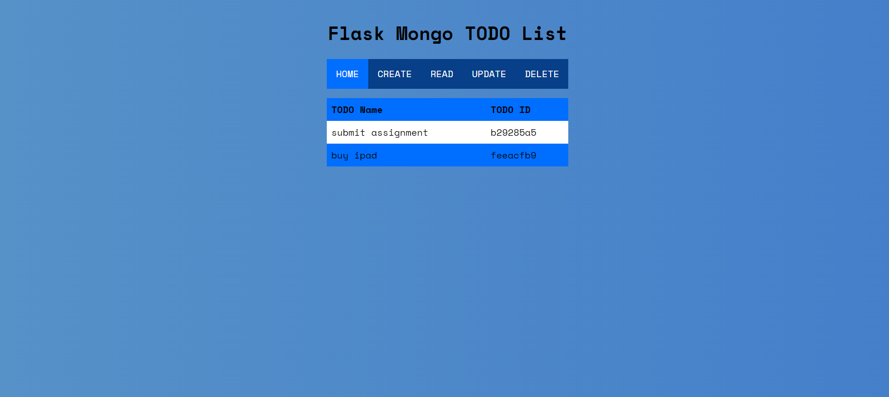

 
  
  &#xa0;

<h1 align="center">To Do App</h1>

  

  

  

   

  

  

<!-- Status -->

<h4 align="center"> 
	🚧 🚀 Flask based To Do App using MongoDB. 🚧
</h4> 

  <a href="#dart-about">About</a> &#xa0; | &#xa0; 
  <a href="#rocket-technologies">Technologies</a> &#xa0; | &#xa0;
  <a href="#white_check_mark-requirements">Requirements</a> &#xa0; | &#xa0;
  <a href="#man_office_worker-contributing">Contributing</a> &#xa0; | &#xa0;
  <a href="https://github.com/muskaan712" target="_blank">Author</a>

 

## :dart: About ##

This is a simple to do app. The user can perform the basic CRUD Operations in the interface. The app will access list items through object ID.

## :rocket: Technologies ##

The following tools were used in this project:

- [Python](https://downloads.python.org/)
- [Pymongo](https://pymongo.readthedocs.io/)
- [flask](https://flask.palletsprojects.com/)
- [mongodb](https://www.mongodb.com/)
- [HTML]
- [CSS]
- [Heroku for Deployment]

## :white_check_mark: Requirements ##

Before starting :checkered_flag:, you need to have [Git](https://git-scm.com), [Python 3.8](https://downloads.python.org/), and the above Libraries installed.

# :man_office_worker: Contributing ##
For major changes, please open an issue first to discuss what you would like to change.

## :memo: License ##

This project is under license from MIT. For more details, see the [LICENSE](LICENSE.md) file.

Made with :heart: by <a href="https://github.com/muskaan712" target="_blank">Muskaan Chopra</a>

&#xa0;

<a href="#top">Back to top</a>
